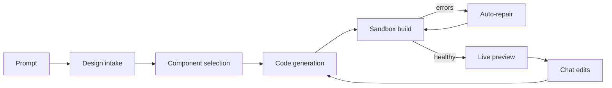

# Volturiano Agent

Describe a website. Watch an AI agent plan it, write it, fix its own mistakes and hand you a real React app.


<!-- TODO: replace with a recording of a full build at docs/assets/demo.gif -->

## What it does

- **Plans first.** It asks a few short questions about audience, look and tone, then locks a design brief before writing any code.
- **Picks components.** It searches a local registry of ready-made sections and installs the ones that fit.
- **Writes real code.** It creates and edits files in a React, Vite and Tailwind project, one tool call at a time.
- **Runs it in a sandbox.** Every project lives in its own E2B sandbox with a live preview.
- **Repairs its own errors.** After each change it checks the build. If something broke, it gets the error back and fixes it.
- **Edits by chat.** Ask for a change in plain words. Undo a turn if you do not like it.
- **Lets you take the code.** Download a zip, or push the project to your own GitHub repository.

## How it works



You type a prompt. A short design intake turns it into a brief with a palette, type and tone. The agent then runs a loop: it calls a model, the model calls tools (read a file, edit a file, install a component, check the build), and the results go back to the model. A harness around the loop refuses to end a turn until the build has been checked. If the check fails, the agent gets the error and a few extra steps to repair it. When the preview is healthy, you see the site and can keep editing by chat.

More detail is in [docs/ARCHITECTURE.md](docs/ARCHITECTURE.md).

## Quick start

You need Node.js 20 or newer, one model provider key and an [E2B](https://e2b.dev) key.

```bash
git clone https://github.com/Firathubgit/MainSite_Volturiano.git volturiano-agent
cd volturiano-agent
cp .env.example .env
npm install
npm run dev
```

Open `.env` and add your keys before the last step. Then open http://localhost:5173.

On Windows, use `copy .env.example .env` for the third command.

### Environment variables

| Variable | Required | What it is |
|---|---|---|
| `GEMINI_API_KEY` | One of these three | Google Gemini key. Gemini is the default model. |
| `OPENAI_API_KEY` | One of these three | OpenAI key. |
| `ANTHROPIC_API_KEY` | One of these three | Anthropic key. |
| `E2B_API_KEY` | Yes | Sandbox key. Builds and previews run in E2B. |
| `PORT` | No | API port. Default `3001`. |
| `CORS_ORIGIN` | No | Allowed origins, comma separated. Default is the local UI. |
| `RATE_LIMIT_PER_MINUTE` | No | Model and sandbox requests per minute. Default `60`, `0` turns it off. |
| `DATA_DIR` | No | Where projects and history are stored. Default `.data/`. |
| `REGISTRY_DIR` | No | Component registry folder. Default `packages/registry`. |
| `OPENAI_BASE_URL` | No | Use an OpenAI-compatible endpoint. |
| `CHROMIUM_NO_SANDBOX` | No | Set to `true` if Chromium cannot start in your container. |
| `GITHUB_PUBLISH_CLIENT_ID` | No | GitHub OAuth app id, for publishing to GitHub. |
| `GITHUB_PUBLISH_CLIENT_SECRET` | No | GitHub OAuth app secret. |
| `GITHUB_TOKEN_ENCRYPTION_KEY` | No | 64 hex characters. Encrypts the stored GitHub token. |

There is no login and no database to set up. Projects, snapshots and chat history are JSON files in `.data/`.

## Supported models and providers

| Provider | Models in the picker | Key |
|---|---|---|
| Google | Gemini 3.5 Flash (default), Gemini 2.5 Flash, Gemini 3.1 Pro Preview | `GEMINI_API_KEY` |
| OpenAI | GPT-5.5, GPT-5.5 mini | `OPENAI_API_KEY` |
| Anthropic | Claude Opus 4.7, Claude Haiku 4.5 | `ANTHROPIC_API_KEY` |

One key is enough. If you pick a model from a provider you have no key for, the server uses the closest model from a provider you do have. See [docs/PROVIDERS.md](docs/PROVIDERS.md).

## Tools the agent can call

| Tool | What it does |
|---|---|
| `list_files` | Lists the files in the project. |
| `read_file` | Reads a file, or a range of lines. |
| `search_files` | Searches the project for a text pattern. |
| `create_file` | Creates a new file. |
| `edit_file` | Replaces an exact piece of text in a file. |
| `replace_file` | Rewrites a whole file. |
| `delete_file` | Deletes a file. Core build files are protected. |
| `get_build_errors` | Checks whether the project builds and renders. |
| `plan_pages` | Plans routes and shared navigation for multi-page sites. |
| `browse_components` | Searches the component registry. |
| `fetch_component_bundle` | Reads the source of a registry component. |
| `install_component_bundle` | Writes a registry component into the project. |
| `install_packages` | Installs npm packages from an allow-list. |
| `reset_sandbox_app` | Resets the sandbox to the starter app. Only used by an explicit reset. |

Details and permission levels are in [docs/TOOLS.md](docs/TOOLS.md).

## Project layout

| Path | What is in it |
|---|---|
| `apps/web/` | The UI: prompt screen, design intake, chat, live preview, file view, projects. React and Vite. |
| `apps/server/` | The API and the agent: loop, tools, sandbox, storage, GitHub publish. Express. |
| `apps/server/lib/agent/` | Context assembly, memory, compaction, tool policy, tool runtime, session store. |
| `apps/server/shared/` | The agent loop, model registry and sandbox file operations. |
| `packages/registry/` | Components and templates the agent can install. Plain files. |
| `docs/` | Architecture, tools, providers and design decisions. |

## Tests and CI

```bash
npm run lint
npm run build
npm test
```

`npm test` runs unit tests with Vitest and then the agent harness regression, which drives the agent loop with fake models and a fake sandbox. Nothing in the test suite needs an API key. CI runs the same three commands on every push and pull request.

## Honest limits

- **You need an E2B key.** There is no local sandbox yet. Without the key nothing builds.
- **It costs money per build.** A first build makes many model calls with a large context. I have not measured this carefully. Expect cents with a small fast model and possibly a dollar or more with a large one. Sandbox time is billed by E2B on top.
- **It builds front ends only.** React, Vite and Tailwind. No backend, no database, no auth in the generated site.
- **The registry is small.** It ships with six plain sections. The agent writes most of the site itself.
- **One user, one machine.** There is no login. Do not expose the server to the internet as it is.
- **Results vary.** Design quality depends a lot on the model. Repair stops after two failed rounds and leaves the error for you.
- **Memory is trimmed.** Each turn sees a summary of the last few turns and saved project notes, not the full chat history.
- **Chromium is part of the loop.** The build check opens the preview in headless Chromium (through Puppeteer) to read errors and take screenshots. If Chromium is missing, checks are weaker.
- **Storage is simple.** JSON files are fine for one person. They are not a database.

## Roadmap

1. A local sandbox option (Docker) so E2B is not required.
2. Token and cost reporting per turn.
3. A larger registry, and semantic search over it.
4. An optional Postgres store behind the same query interface.
5. A recorded evaluation set to compare models on the same prompts.

## Why I built it

It started as the website builder inside my company, Volturiano Studios in Göteborg. Over time the agent became its own piece: a loop, a set of tools and a harness that checks the work. I opened up that core so others can learn from it and build on it. The business parts of the product stayed private.

## Contributing

Issues and pull requests are welcome. Start with [CONTRIBUTING.md](CONTRIBUTING.md).

## License

[MIT](LICENSE). Third-party code and assets are listed in [THIRD_PARTY_NOTICES.md](THIRD_PARTY_NOTICES.md).

## Author

Firat Kaya

- GitHub: https://github.com/Firathubgit
- LinkedIn: https://www.linkedin.com/in/firat-kaya-baba45267
- Portfolio: https://firatportfolio.com
