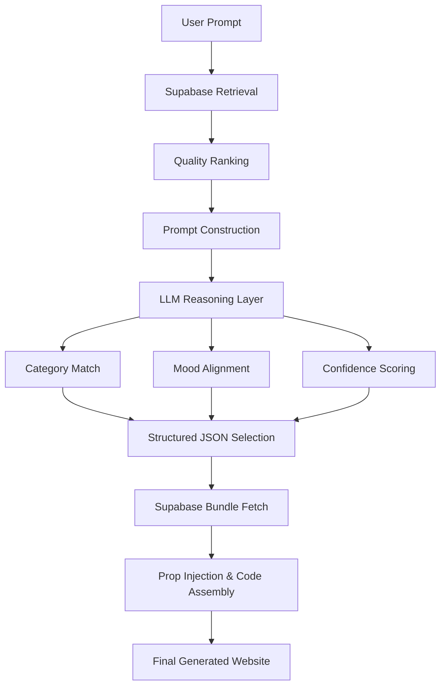

# Technical Deep Dive: Supabase & LLM Component Selection Process

The selection process is a sophisticated "Search-Augmented Generation" (RAG) pipeline designed to match natural language prompts with a curated library of high-fidelity UI components. It moves from raw database retrieval to cognitive reasoning by an LLM, and finally to automated code synthesis.

## 1. Data Retrieval: The Supabase Layer

Before the LLM even sees the prompt, the system prepares the "knowledge base" from Supabase.

### A. Catalog Fetching & Quality Weighting
The system queries the `components` table for all active records. However, simply sending every component to the LLM would hit token limits and reduce accuracy. To solve this, the registry applies a **Discovery Rank** formula to the results:

$$Rank = (QualityScore \times 0.4) + (RatingAvg \times 0.3) + \log(UsageCount + 1) \times 0.3$$

- **Quality Score:** Human-curated score of the component's code and design quality.
- **Rating Avg:** Community feedback and performance metrics.
- **Usage Count:** Popularity and stability indicator.

Components are sorted by this rank, ensuring that the "best" components (official, high-rated, and stable) are always at the top of the list sent to the LLM.

### B. Category Intelligence
Simultaneously, the system fetches categories from `component_categories`. This gives the LLM a structural map of what a "website" actually consists of (e.g., *Navbars, Heroes, Features, CTA, Footers*).

---

## 2. Context Engineering: The LLM Prompt

The system constructs a high-fidelity prompt for the LLM (typically GPT-4o or Claude 3.5 Sonnet). Instead of just sending component names, it sends a JSON manifest with "Semantic Metadata":

- **visualDescription:** Detailed text describing the layout, animations, and visual "hook".
- **suitableFor:** A list of industries or use cases (e.g., "SaaS", "Photography", "Agency").
- **moodTone:** The aesthetic vibe (e.g., "Cinematic", "Brutalist", "Minimalist").
- **colorProfile:** Information about light/dark mode and warmth.
- **authorType:** Distinguishes between "Official" (Volturiano team) and "Community" components.

---

## 3. Cognitive Selection: How the LLM Decides

The LLM follows a strict **5-Step Decision Process** defined in its system instructions:

1.  **Structural Planning:** It analyzes the prompt to identify required sections. (e.g., "I need a landing page for a gym" $\rightarrow$ Navbar, Hero, Pricing, Testimonials).
2.  **Industry Matching:** It cross-references the user's intent with the `suitableFor` field in the catalog.
3.  **Aesthetic Coordination:** It looks for components that share a similar `moodTone` and `colorProfile` to ensure the final site doesn't look like a "frankenstein" of mismatched styles.
4.  **Confidence Scoring:** It assigns a score (0 to 1) to each selection. If a component is a near-perfect match for the request, it receives a high score (>0.8).
5.  **Prop Customization:** The LLM generates `propsOverrides`. Instead of just picking a component, it decides which text, colors, or images inside that component should be changed to fit the user's prompt.

---

## 4. Final Assembly: From IDs to Code

Once the LLM returns its structured selection (a JSON list of IDs), the **Ultra Pipeline** takes over:

1.  **Bundle Retrieval:** The system makes a secondary query to Supabase to fetch the actual `bundle_code` (the source code) for every selected ID.
2.  **Asset Preflight:** It runs a "sanity check" on any external images or videos used in the components to ensure they are still online and reachable.
3.  **Code Injection:** The `propsOverrides` are injected into the component code via regex or AST manipulation.
4.  **Synthesis:** The registry synthesizes a main `App.jsx` and a global `index.css`, importing the selected components and wrapping them in a cohesive layout.

---

## 5. Summary Flow Diagram

> [!NOTE]
> **Why this matters:** This process ensures that the AI isn't just "dreaming up" code from scratch (which is often buggy), but is instead **acting as an expert curator** picking refined, production-ready components from your Supabase library.
