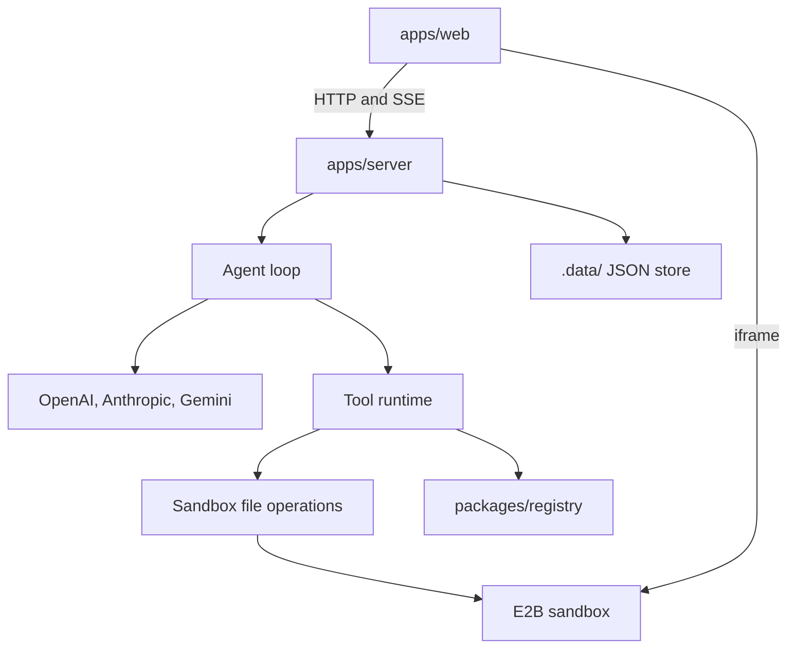

# Architecture

Volturiano Agent has three parts:

- **`apps/web`**: the UI. Prompt screen, design intake, chat, live preview, file view and project list.
- **`apps/server`**: the API and the agent. It talks to model providers and to the sandbox.
- **`packages/registry`**: components and templates the agent can install.

The generated website does not run on your machine. It runs inside an [E2B](https://e2b.dev) sandbox, and the preview you see is the sandbox's own Vite dev server.

## Modules

### Server

| Path | Job |
|---|---|
| `index.js` | Express app. Routes, rate limit, body limits, error handling. |
| `routes/agent.js` | `initial-build`, `message`, `undo`, `session`. Streams agent events to the UI. |
| `shared/agent-loop.js` | The loop and the harness around it. Provider adapters for native Gemini and the AI SDK. |
| `lib/agent/tool-runtime.js` | Tool definitions, argument validation, execution, source-size safety. |
| `lib/agent/tool-policy.js` | Permission modes and feature gates that decide which tools a turn can see. |
| `lib/agent/context-assembler.js` | Builds the context envelope for a turn. |
| `lib/agent/project-context.js` | Saved project facts: prompt, design brief, build mode, latest snapshot. |
| `lib/agent/memory-manager.js` | Short durable notes derived from each turn. |
| `lib/agent/session-store.js` | Sessions, turns, messages, tool events, undo snapshots. |
| `lib/agent/compaction.js` | Fits context into a fixed character budget. |
| `lib/agent/response-normalizer.js` | Cleans the model's final answer for the chat. |
| `lib/agent/debug-timeline.js` | Optional structured trace of a turn, with secrets scrubbed. |
| `shared/sandbox-fs.js` | Safe file operations inside the sandbox. |
| `lib/sandbox/*` | Sandbox manager and the E2B provider. |
| `lib/verify-sandbox-build.js` | The build check. |
| `lib/screenshot.js` | Headless Chromium: console capture, render metrics, screenshots. |
| `lib/design/*` | Design intake and design brief. |
| `lib/registry/*` | File-based registry loader and component ranking. |
| `lib/store/*` | Local JSON store and file storage. |
| `lib/github/*`, `routes/integrations/github.js` | Publish a project to a GitHub repository. |
| `lib/provider-helpers.js`, `shared/model-registry.js` | Provider clients, model list, fallback across providers. |
| `routes/apply-ai-code-stream.js` | Writes a set of files into a sandbox. Used when a saved project is reopened. |

### Web

| Path | Job |
|---|---|
| `src/builder/PromptPage.jsx` | Start screen: prompt, reference images, model, template. |
| `src/contexts/RouteTransitionContext.jsx`, `src/components/RouteTransitionOverlay/` | The design intake shown between the prompt and the build. |
| `src/builder/generation/Generation.jsx` | Chat, preview, file tree, snapshots, export and publish. |
| `src/builder/generation/useAgentMode.js` | Sends agent requests and consumes the event stream. |
| `src/builder/projects/ProjectsPage.jsx` | List, open, rename and delete projects. |

## Data flow of a first build

1. **Prompt.** The UI collects the prompt, optional reference images and a model.
2. **Design intake.** `POST /api/design-intake/prepare` asks a small model for a few questions, a palette and type options, and matching registry components. The user answers. `POST /api/design-intake/finalize` turns the answers into a design brief and a build prompt.
3. **Project and sandbox.** The UI creates a project (`/api/projects/init`) and a sandbox (`/api/create-ai-sandbox-v2`). The sandbox starts a React, Vite and Tailwind starter app.
4. **Initial build.** `POST /api/agent/initial-build` starts the agent loop with the build prompt and the design brief. Events stream back over SSE.
5. **Snapshot.** When the turn ends, the UI reads the sandbox files and saves a snapshot (`/api/snapshots`). A thumbnail is captured in the background.

Chat edits use `POST /api/agent/message` and follow steps 4 and 5.

## How a turn works

A turn is one user message and everything the agent does in response.

**1. Context.** The server builds a context envelope from three sources and trims it to a fixed budget:

- project context: original prompt, design brief, build settings, latest snapshot info
- memory: short notes saved from earlier turns
- recent turns: what the user asked, what changed, which tools ran

Recent turns get a guaranteed share of the budget so the agent does not lose track of what it just did.

**2. Tools for this turn.** The tool policy decides which tools the model can see. Registry tools are hidden when the registry is empty. On a first build they are on. On an edit they are on only when the request looks like it could use a component. Package installs and the sandbox reset are behind their own gates.

**3. The loop.** The model is called with the system prompt, the context, the conversation and the tools. If it calls tools, the runtime runs them and returns the results, and the model is called again. This repeats until the model answers with plain text or the step budget runs out. An edit turn has 20 steps. A first build has 35.

**4. The harness decides if the turn is done.** When the model stops calling tools, the harness checks its work before accepting the answer. This is described in the next section.

**5. Persistence.** The turn, its tool events, the changed files and a compact tool transcript are saved. Memory notes are derived from the turn. An undo snapshot of the files as they were before the turn is stored, so the turn can be undone.

Every file write goes through `shared/sandbox-fs.js`, which keeps paths inside the project, refuses binary files for text edits, protects core build files, and returns a structured patch for the chat and for undo.

## How auto-repair works

The model is not trusted to say "done". The harness in `shared/agent-loop.js` (`decideEndOfTurn`) applies these rules when the model stops calling tools:

1. **No changes, no check.** If the turn did not modify any file, it ends.
2. **Stale check.** If files changed after the last build check, the harness runs the check itself.
3. **Failed check.** If the check fails, the harness sends the failure back to the model as a message and grants 5 extra steps. The model is asked to fix the root cause with targeted edits and check again. This can happen twice per turn.
4. **Give up cleanly.** After two failed repair rounds the turn ends and reports that the build is not healthy.
5. **Visual review.** When the build is healthy, and the turn was a first build or touched several files, the harness attaches a screenshot of the preview and grants 6 steps for a visual pass.

The build check (`lib/verify-sandbox-build.js`) uses the live preview instead of a slow production build. It opens the sandbox preview in headless Chromium and collects:

- the Vite error overlay, if a file failed to compile
- console errors, page errors and failed requests
- render metrics, to catch a blank page

Known harmless console noise is filtered so the agent does not chase it.

There is a second, older repair path in `lib/auto-repair.js`. It is used by `apply-ai-code-stream` when a set of files is written in one go (for example when a saved project is restored into a new sandbox) and the build fails. It asks a small model to fix the listed files.

## Storage

There is no database. `lib/store/local-db.js` keeps each table as one JSON file under `.data/db/` and offers a small query builder (`from`, `select`, `eq`, `in`, `order`, `limit`, `insert`, `update`, `upsert`, `delete`) that resolves to `{ data, error }`. Binary files (thumbnails, reference images) are stored under `.data/files/`.

| Table | Holds |
|---|---|
| `projects` | One row per project. |
| `snapshots` | Full file maps of a project at points in the chat. |
| `agent_sessions`, `agent_turns`, `agent_messages`, `agent_tool_events` | The agent's history. |
| `agent_memory` | Notes derived from turns. |
| `agent_undo_snapshots` | Files as they were before a turn. The last 10 per sandbox. |
| `github_connections` | The encrypted GitHub token, if you connect GitHub. |

There is no login. `middleware/local-user.js` attributes every request to one local user. Routes still read `req.user.id`, so that is the place to add real authentication.

## Registry

`lib/registry/source.js` reads `packages/registry` at startup. `lib/registry/registry.js` ranks components for a prompt with keyword and intent matching: section role, site type, mood and color mode. The agent sees metadata only when it browses. Source is written straight into the sandbox when it installs a component, so large files do not fill the model's context.

See [packages/registry/README.md](../packages/registry/README.md).

## Design decisions

Short records of the larger choices are in [decisions/](decisions/).
